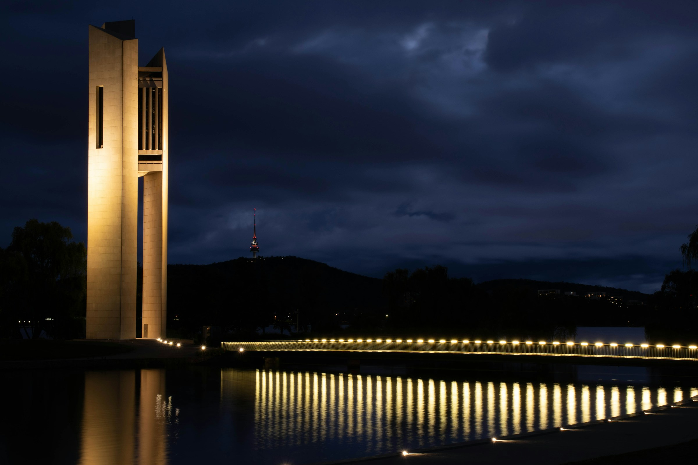

# Responsive Design System 

To create an adaptive website, I utilised multiple media queries to target different screen sizes to ensure elements and texts on the site are scaling up and down in correspondence to the device size. Additionally, when the screen size is too small for the navigation bar, it will be hidden and replaced with a dropdown menu.

In this code:

    @media (max-width: 768px){
        .links, .search-btn{
            display: none;
        }
        .toggle-btn{
            display: block;
        }
    }
 
The browser checks the width of the device. If the information returned matches the parameters, the CSS styling will be applied. In this case, if the width of the screen of the device is 768 pixels or less, the  `nav .links` and `.search-btn` in the navigation bar will not be displayed. Then the .toggle-btn will be displayed as a block element.

A couple of issues I encountered with the media query is when some of the media queries weren't placed at the bottom of the CSS code. After researching and remembering that CSS is read from top to bottom, I placed all the media queries at the bottom. The placement of all the media queries also made it easier to observe any conflicting queries in my CSS code.

To achieve maximum flexibility, I used flexible and relative units like rems, em, % vh etc. These relative units allow the content to be scaled up and down when the browser is resized.

    <form action="action_page.php">
    <label for="fname">First Name</label>
    <input type="text" id="fname" name="firstname" placeholder="Your name..">

In this code generated by AI, a `<form>` element is created to store and process the input fields. For better accessibility, there is a corresponding label tag for each of the input fields. This provides better semantic value and accessibility for screen readers.

### References

 

 

 

 
